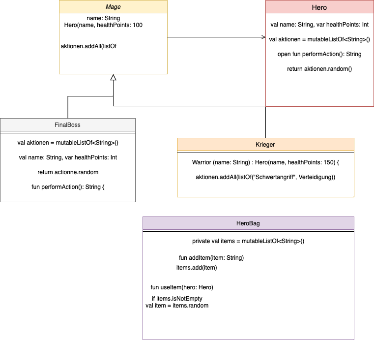

1.	Erstelle ein Projekt in IntelliJ :
       Erstellt ein neues Kotlin-Projekt in IntelliJ.
       Erstellt eine Hauptdatei (main.kt), in der das Spiel stattfinden wird.
       Erstellt separate Dateien für jede Klasse im Spiel.
2.	Erstelle die Klassen der Helden :
       Erstellt eine allgemeine Klasse Hero mit gemeinsamen Eigenschaften wie Name, Gesundheitspunkte (HP) und einer Liste von Aktionen.
       Erstelle spezifische Klassen für jeden Heldentyp (Magier, Krieger usw.), die von der Klasse Hero erben.
       Legt die spezifischen Aktionen für jeden Heldentyp fest.
3.	Erstelle die Tasche der Helden :
       Erstelle eine Klasse HeroBag, die die Tasche mit den Gegenständen der Helden verwaltet.
       Fügt die Gegenstände (Heiltrank, Vitamine usw.) zur Tasche hinzu.
       Implementiert die Logik, die es den Helden erlaubt, den Beutel einmal pro Runde zu benutzen.
4.	Erstelle die Klasse des Bosses :
       Erstellt eine Klasse für den Endboss.
       Legt die Eigenschaften des Bosses fest, einschließlich der Gesundheitspunkte (HP) und der spezifischen Aktionen (Flächenangriff, Fluch, Beschwörung von Unterbossen usw.).
5.	Implementiere das Kampfsystem :
       Entwickle ein rundenbasiertes Kampfsystem, bei dem zuerst die Helden und dann der Boss agieren.
       Die Aktionen der Helden werden über die Konsole ausgewählt, indem der Spieler für jeden Helden eine Aktion auswählen muss.
       Die Aktionen des Bosses werden nach dem Zufallsprinzip ausgewählt.
       Berechnet die Auswirkungen der Aktionen (Schaden, Heilung, Schutz usw.) und aktualisiert die Gesundheitspunkte entsprechend.
6.	Verwalte die Runden und das Ende des Kampfes :
       Erstellt eine Logik, um die Runden zu verwalten, indem jedes Team einmal pro Runde spielen darf.
       Überprüft das Ende des Kampfes, wenn die Gesundheitspunkte eines Teams auf null sinken.
7.	Kampfstatus in der Konsole anzeigen :
       Zeigt die Aktionen an, die der Gegner (Boss) in jeder Runde durchführt.
       Zeigt die verbleibenden Gesundheitspunkte der Helden und des Bosses in jeder Runde an, damit der Spieler den Kampf verfolgen kann.
8.	Optionale Funktionen einbauen :
       Fügt kritische Treffer mit einer Wahrscheinlichkeit hinzu.
       Integriert Statistiken (Grundschaden, Geschwindigkeit, Rüstung usw.) für Helden und Boss.
       Nutzt Stärken und Schwächen entsprechend der Elementarten (Feuer, Wasser usw.) für Helden und Gegner aus.
9.	Testen des Kampfsystems :
       Führe Tests durch, um zu überprüfen, ob das Kampfsystem richtig funktioniert.
       Stelle sicher, dass alle Funktionen, einschließlich der optionalen Funktionen, funktionieren.
10.	Führen Sie das Kampfsystem dem Team vor:
        Bereite eine Demonstration des Kampfsystems anhand eines beispielhaften Bosskampfes vor.
        Erkläre die Funktionsweise des Spiels, die Klassen, die Mechanik und die eingebauten Funktionen.